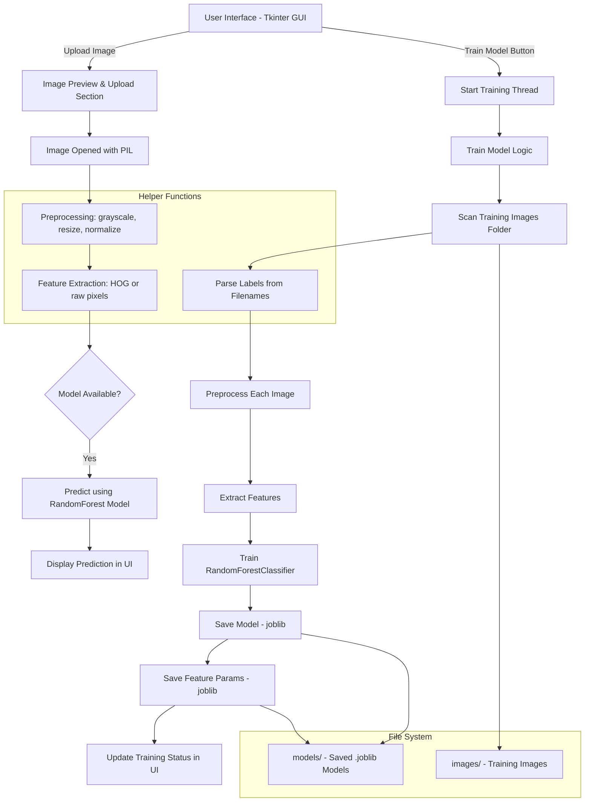

# Digit Classification

## Project Overview

Digit Classification is a desktop application built using Python's Tkinter library that allows users to classify handwritten digits. The app provides a simple graphical interface for drawing or uploading digits, processes the input using a machine learning model, and displays the predicted digit.

## Features

- Intuitive Tkinter GUI for digit input (drawing or uploading images)
- Integration with a digit classification machine learning model (e.g., trained on MNIST)
- Real-time prediction display
- Simple and lightweight application suitable for learning and demo purposes
- Modular design for easy updates and model improvements

## Technologies & Tools Used

- Python 3.x
- Tkinter for the graphical user interface
- Machine learning libraries (e.g., TensorFlow, PyTorch, or scikit-learn) — specify if used
- Numpy and PIL (Python Imaging Library) for image processing
- SQLite (optional) for storing results or user data (if applicable)

## Installation

1. **Clone the repository**

   ```bash
   git clone https://github.com/maruf-pfc/digit-classification.git
   cd digit-classification
    ```

2. **Create and activate a virtual environment (recommended)**

   ```bash
   python -m venv .env
   source .env/bin/activate  # On Windows: .env\Scripts\activate
   ```

3. **Install dependencies**

   If your project uses external libraries, install them via:

   ```bash
   pip install -r requirements.txt
   ```

   Example `requirements.txt` might include:

   ```
    numpy
    opencv-python
    Pillow
    scikit-learn
    scikit-image
    pandas
    joblib
   ```

   Adjust according to your actual dependencies.

## How to Run

Run the main script to launch the GUI:

```bash
python src/main.py
```

If the app fails to run, the reason can be related to the Operating System. I tried this on Windows first, and it's working perfectly. But in Linux I have to install this

```bash
sudo apt install python3-tk
```

## Flow-Chart



## Usage

* Run `python main.py` to launch the app.
* Draw or upload a digit using the GUI.
* Click the classify button to see the predicted digit.
* Use the clear button to reset the drawing canvas.

## Future Improvements

* Support for batch classification of multiple images
* Improved UI/UX with enhanced drawing tools
* Add confidence score and visualization
* Support for different digit datasets beyond MNIST

## License

This project is licensed under the Apache License. See the [LICENSE](LICENSE) file for details.
